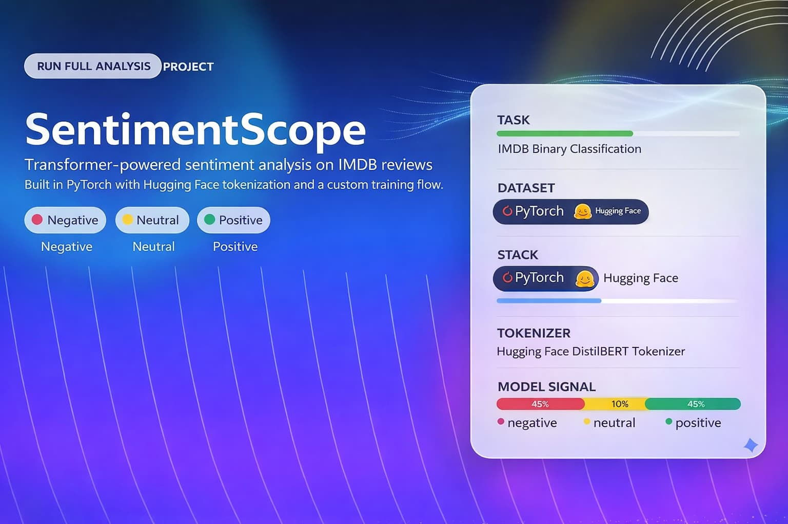

<div align="center">



# SentimentScope

### Transformer-Powered Movie Review Sentiment Analysis

<p>
A sentiment analysis project built with PyTorch and Hugging Face tooling to classify IMDB movie reviews with a transformer-based architecture.
</p>

<p>
  
  
  
</p>

</div>

---

## The Problem

Movie review sentiment classification is a simple problem to explain and a strong one for evaluating NLP execution. The goal is to classify IMDB reviews as `positive` or `negative` using a transformer-based architecture with a reproducible training and evaluation flow.

## Project Overview

- IMDB review preprocessing pipeline for binary classification
- `bert-base-uncased` tokenization with Hugging Face
- custom PyTorch transformer-based sentiment classifier
- training loop with validation tracking and checkpoint saving
- test evaluation workflow aligned with course success criteria

## Technical Highlights

**ML Engineering**
Data preparation, batching, modeling, training, and evaluation in one end-to-end workflow.

**NLP**
Tokenization, sequence modeling, and sentiment classification on a standard benchmark dataset.

**Frameworks**
PyTorch for model/training logic and Hugging Face for tokenizer integration.

**Engineering Quality**
Clear structure, readable notebook flow, and documentation that supports quick review.

## Architecture Flow

```text
IMDB Reviews
   -> Text preprocessing
   -> BERT tokenizer
   -> Token IDs + attention masks
   -> Transformer-based sentiment model
   -> Validation tracking
   -> Best checkpoint
   -> Final test evaluation
```

## Results

- Includes full validation and test evaluation flow in the notebook
- Built to satisfy the project target of exceeding `75%` test accuracy
- Saves the strongest validation checkpoint for final evaluation reuse

## Tech Stack

<p>
  
  
  
  
  
  
</p>

## Repository Structure

```text
.
|-- README.md
|-- requirements.txt
`-- starter/
    |-- README.md
    `-- SentimentScope_starter.ipynb
```

## Run Locally

```bash
git clone https://github.com/mohamed-elkholy95/sentimentscope-transformer-sentiment-analysis.git
cd sentimentscope-transformer-sentiment-analysis
python -m venv .venv
.venv\Scripts\activate
pip install -r requirements.txt
jupyter notebook
```

Then open `starter/SentimentScope_starter.ipynb` and run the notebook cells in order.

## Notes

- Originally developed as the capstone project for a Udacity nanodegree program
- Uses the IMDB sentiment dataset for binary classification
